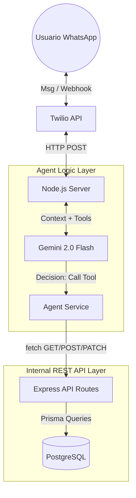
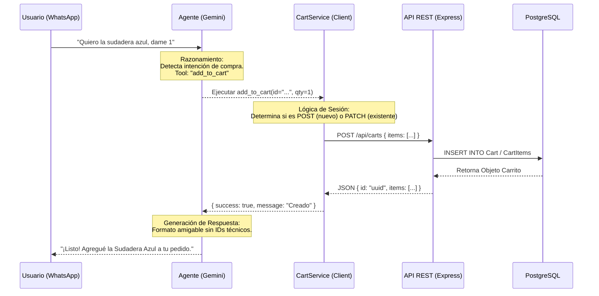

# Diseño del Agente de Ventas IA - Laburen Challenge

## 1. Visión General y Arquitectura

El sistema implementa un Agente Conversacional Transaccional diseñado para actuar como un representante de ventas (Sales Rep) en WhatsApp. El núcleo del sistema se basa en una arquitectura desacoplada donde el Agente de IA actúa como un cliente orquestador que consume una API REST interna, simulando una integración real de servicios.

### Componentes del Sistema

- Interface (Frontend): WhatsApp (vía Twilio Sandbox API).
- Backend & API: Node.js + Express. Exponiendo endpoints RESTful (/api/products, /api/carts).
- Cerebro (Reasoning Engine): Google Gemini 2.0 Flash. Seleccionado por su latencia ultra-baja y capacidad superior de Function Calling.
- Persistencia (DB): PostgreSQL (Neon.tech) con Prisma ORM.
- Infraestructura: Desplegado en Koyeb (PaaS).

### Diagrama de Arquitectura de Alto Nivel

## 2. Flujo de Interacción (Sequence Map)

El siguiente diagrama ilustra cómo el agente maneja una solicitud de compra, actuando como intermediario entre el usuario y la API REST.

1. Recepción: El usuario pide un producto.
2. Razonamiento: Gemini decide usar la herramienta add_to_cart.
3. Consumo API: El servicio ejecuta un fetch a la API local (http://localhost...).
4. Persistencia: La API guarda en PostgreSQL.
5. Respuesta: La API devuelve el objeto creado, y Gemini redacta la confirmación.

## 3. Definición de Endpoints y Herramientas (Tools)

El agente no accede a la base de datos directamente. Utiliza herramientas definidas que consumen los endpoints REST requeridos por el desafío.

### API REST (Nivel de Negocio)

| Herramienta (Tool Name) | Descripción | Endpoint Consumido | Verbo HTTP |
| :--- | :--- | :--- | :--- |
| search_products | Busca en catálogo por query. | /api/products?q={query} | GET |
| add_to_cart | Agrega items (crea carrito si es necesario). | /api/carts | POST |
| update_cart_item | Modifica cantidad de un item existente. | /api/carts/:id | PATCH |
| clear_cart | Cierra la sesión de compra actual. | (Lógica interna / Reset) | N/A |

### Estrategia de Prompt Engineering (System Prompt)

El agente opera bajo reglas estrictas configuradas en agentService.js:

1. Rol: Vendedor profesional de "Laburen".
2. Sanitización: "NO muestres IDs: Nunca muestres los UUIDs al usuario."
3. Formato: "Formato de Precio: Muestra precios limpios ($15.50) sin caracteres de escape."
4. Estilo: Uso de negritas (*) para resaltar productos y listas para facilitar la lectura en móvil.

## 4. Métricas de Viabilidad y Éxito

1. Latencia: Gracias al uso de gemini-2.0-flash y el despliegue en la nube, el tiempo de respuesta promedio es < 3 segundos.

2. Manejo de Sesión: Se implementó un sistema de mapeo en memoria (activeCarts) para vincular el waId (WhatsApp ID) con los uuid de los carritos de la API anónima.

3. Resiliencia: El sistema maneja errores 404/500 de la API y responde al usuario con mensajes de error amigables ("Tuve un problema consultando el catálogo").