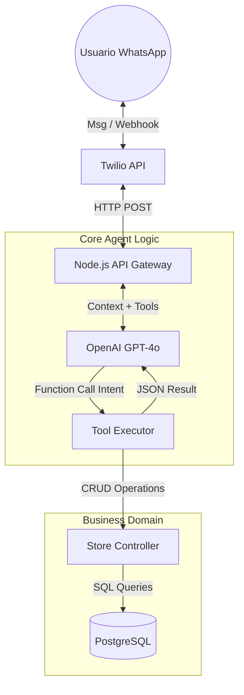
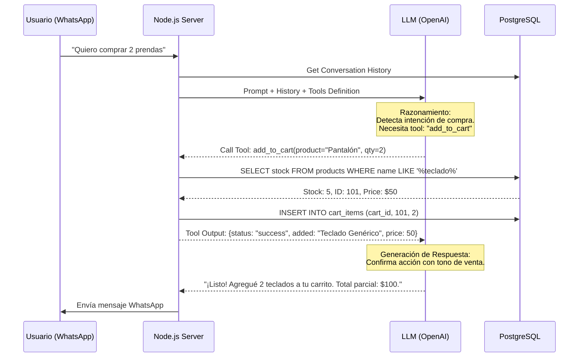

# Diseño del Agente de Ventas IA - Laburen Challenge

## 1. Visión General y Arquitectura

El sistema propone un Agente Conversacional Semi-Autónomo diseñado para actuar como un representante de ventas (Sales Rep). A diferencia de un chatbot basado en árboles de decisión, este agente utiliza un LLM (Large Language Model) como motor de razonamiento para interpretar la intención del usuario y ejecutar herramientas (Function Calling) sobre una API RESTful.

### Componentes del Sistema

- Interface (Frontend): WhatsApp (vía Twilio/Meta API).
- Orquestador (Backend): Node.js + Express + TypeScript. Actúa como el controlador que gestiona el ciclo de vida del mensaje.
- Cerebro (Reasoning Engine): OpenAI GPT-4o-mini (Optimizado para latencia y costo).
- Persistencia (DB): PostgreSQL con Prisma ORM (Garantiza integridad relacional en pedidos y stock).

### Diagrama de Arquitectura de Alto Nivel

## 2. Flujo de Interacción (Sequence Map)

El siguiente diagrama ilustra cómo el agente maneja una solicitud compleja: "Quiero dos prendas, pero fijate si tenés stock".

1. Recepción: El mensaje entra al sistema.
2. Razonamiento: El LLM analiza si necesita datos externos.
3. Ejecución: El sistema consulta la DB.
4. Respuesta: El LLM formula la respuesta final con datos reales.

## 3. Definición de Endpoints y Herramientas (Tools)

El agente interactúa con la base de datos exclusivamente a través de una API interna estructurada, lo que permite desacoplar la lógica de IA de la lógica de negocio.

### API REST (Nivel de Negocio)

| Verbo | Endpoint | Descripción | Herramienta de IA Asociada |
| :--- | :--- | :--- | :--- |
| GET | /products | Busca productos por nombre/descripción. | function: search_products(query) |
| GET | /products/:id | Obtiene detalles específicos (stock/precio). | function: get_product_details(id) |
| POST | /carts | Crea carrito o agrega items. | function: add_to_cart(product_id, qty) |
| PATCH | /carts/:id | Modifica cantidades o elimina items. | function: update_cart_item(item_id, qty) |

### Estrategia de Prompt Engineering (System Prompt)

El agente operará bajo las siguientes directrices estrictas:

1. Role: "Eres un asistente de ventas útil y conciso de Laburen Shop."
2. Constraint: "Nunca inventes precios o stock. Si la herramienta devuelve error, comunícalo al usuario."
3. Format: "Usa emojis moderados y mantén las respuestas cortas (optimizadas para chat móvil)."

## 4. Métricas de Viabilidad y Éxito

Para evaluar el rendimiento del agente en un entorno productivo, se proponen las siguientes métricas clave:

1. Latencia E2E (End-to-End): Tiempo total desde que el usuario envía el mensaje hasta recibir respuesta.
Objetivo: < 4 segundos (para mantener la fluidez en WhatsApp).

2. Tasa de Llamadas a Herramientas (Tool Call Rate): Porcentaje de mensajes que derivan en una acción de base de datos vs. charla casual.
Indicador: Mide la efectividad del agente para cerrar ventas.

3. Tasa de Alucinación (Error Rate): Frecuencia con la que el agente intenta vender productos sin stock (controlado vía validación en backend).