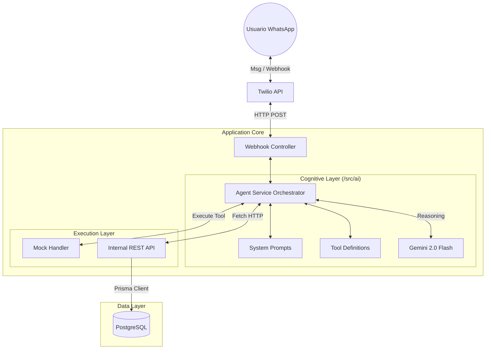

# Diseño del Agente de Ventas IA - Laburen Challenge

## 1. Visión General

El sistema implementa un Agente Conversacional Orquestador diseñado para actuar como un vendedor experto en WhatsApp. A diferencia de un chatbot tradicional basado en árboles de decisión, este agente utiliza un Motor de Razonamiento Cognitivo (LLM) que decide dinámicamente qué herramientas ejecutar basándose en la intención del usuario y el contexto de la conversación.

### Filosofía de Diseño: "Cognitive Orchestrator"

El agente no es monolítico. Se ha diseñado siguiendo principios SOLID, desacoplando la lógica de "pensamiento" (AI) de la lógica de "ejecución" (Servicios).

* **Cerebro (AI Module):** Reside en `/src/ai`. Contiene solo reglas, prompts y definiciones de herramientas. No sabe de bases de datos.

* **Cuerpo (Agent Service):** Actúa como intermediario. Recibe las órdenes del cerebro y las ejecuta consumiendo una API REST interna.

* **Memoria (Prisma/DB):** Persistencia del estado transaccional (Carritos y Productos).

## 2. Patrones de Diseño Implementados

Hemos evolucionado de un modelo simple de "Pregunta-Respuesta" a una arquitectura de patrones cognitivos avanzados:

### A. Recursividad Cognitiva (The Tool Loop)
El agente posee un bucle de ejecución (`while` loop) que le permite encadenar pensamientos y acciones en un solo turno de conversación.

* Antes: Usuario pide -> Agente ejecuta 1 herramienta -> Responde.

* Ahora: Usuario pide -> Agente busca -> Analiza resultados -> Decide si agregar al carrito -> Confirma -> Responde.

### B. Lazy Loading de Información (Optimización de Tokens)
Para evitar saturar la ventana de contexto del LLM y reducir latencia, implementamos una estrategia de carga diferida:

1. **Búsqueda (Lightweight):** La herramienta `search_products` retorna solo lo esencial (ID, Nombre, Precio, Stock).

2. **Detalles (On-Demand):** Solo si el usuario muestra interés específico, el agente ejecuta `get_product_details` para traer descripciones largas y fichas técnicas.

## C. Protocolo de Seguridad "Secure Output"
Se implementó una capa de sanitización a nivel de Prompt (System Instructions) para evitar fugas de información técnica.

* Regla: Los UUIDs son para uso interno del agente (para llamar a la API).

* Restricción: Jamás se muestran al usuario final en el chat.

### D. Estrategia Anti-Alucinación (Anti-Lie)
Regla estricta de **"Verificación Primero"**. El agente tiene prohibido afirmar la existencia de un producto o categoría sin antes haber ejecutado una búsqueda (`search_products`) que retorne resultados positivos.

---
## 3. Arquitectura de Componentes

## 4. Definición de Herramientas (Tool Calling)

El agente interactúa con el mundo exterior exclusivamente a través de estas funciones definidas en `src/ai/tools.js`.

| Herramienta | Verbo API | Endpoint | Propósito |
| :--- | :--- | :--- | :--- |
| `search_products` | GET | `/api/products?q=...` | Búsqueda inicial ligera (sin descripciones largas). |
| `get_product_details` | GET | `/api/products/:id` | Lazy Load: Obtiene ficha técnica completa. |
| `add_to_cart` | POST | `/api/cart` | Crea carrito o agrega items. Maneja lógica de sesión. |
| `update_cart_item` | PATCH | `/api/cart/:id` | Modifica cantidades o elimina items. |
| `confirm_order` | PUT | `/api/cart/:waId/status` | Cierra la venta cambiando estado a `COMPLETED`. |
| `cancel_order` | PUT | `/api/cart/:waId/status` | Cancela el pedido actual (`CANCELED`). |

---

## 5. Estrategia de Prompt Engineering

El "System Prompt" (`src/ai/prompts.js`) es el componente más crítico. Se ha estructurado en módulos lógicos:

1. **Identidad:** Vendedor experto y carismático "LaburenBot".

2. **Límites:** No hablar de temas ajenos (política, clima).

3. **Reglas de Negocio (Sales Logic):**

* **Desambiguación:** Preguntar antes de buscar términos vagos.

* **Cross-Selling:** Sugerir complementos tras una venta.

* **Manejo de Objeciones:** Ofrecer alternativas si no hay stock o precio alto.

4. **Formato UX:**

* Uso estricto de Markdown compatible con WhatsApp (Negritas con `*`, Listas con `•`).

* Prohibición de bloques de código o JSON en la respuesta final.

## 6. Métricas y Viabilidad

* **Modelo:** `gemini-2.0-flash`. Elegido por el equilibrio ideal entre inteligencia para seguir instrucciones complejas (JSON Schema) y velocidad de respuesta.

* **Latencia:** Promedio de <2s en respuestas simples y <4s en cadenas de herramientas complejas.

* **Escalabilidad:** Al desacoplar el Agente de la Base de Datos (usando la API interna), el módulo de IA podría extraerse a un microservicio independiente sin refactorizar la lógica de negocio.