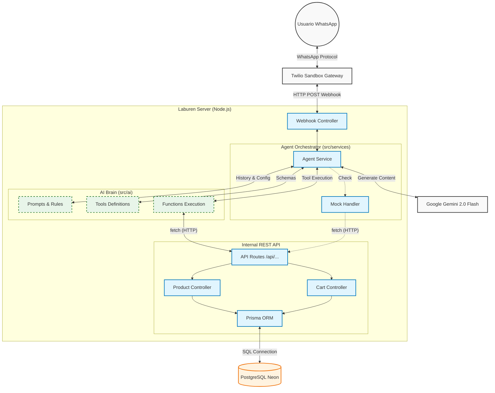
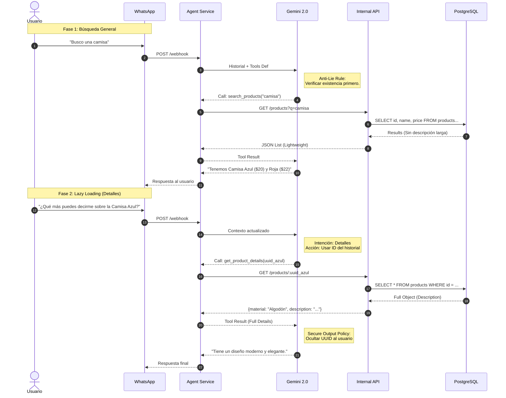
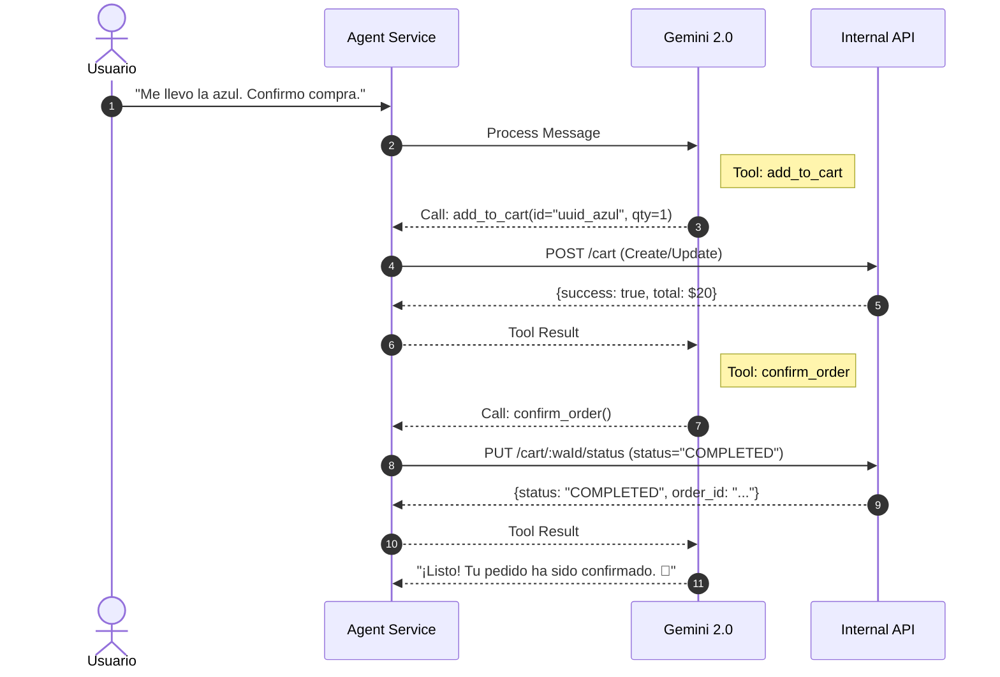
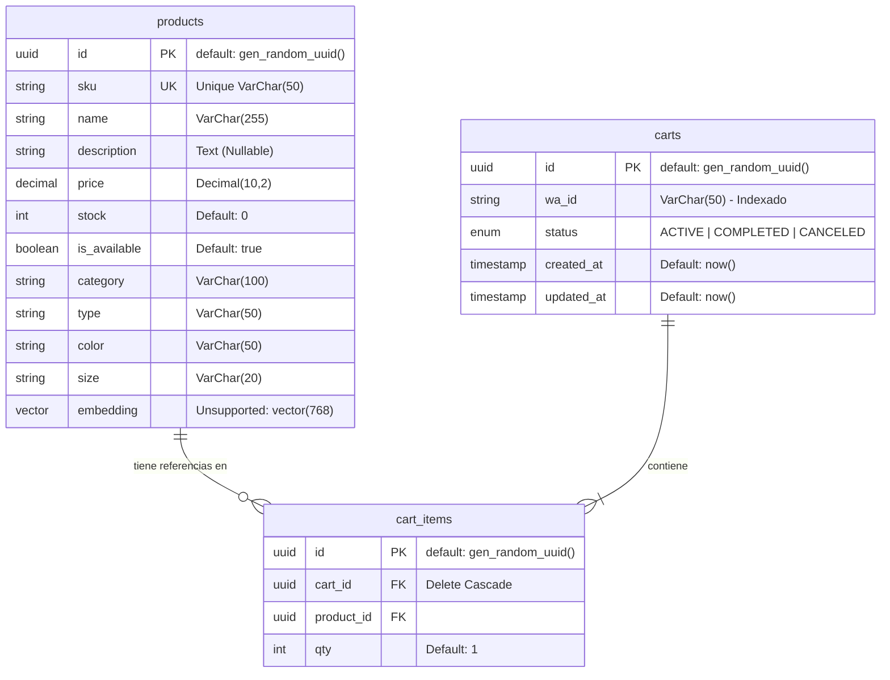

# Diagramas Técnicos - Laburen AI Agent

Este documento detalla la arquitectura, el flujo de datos y el modelo de base de datos del agente.

## 1. Arquitectura de Componentes (C4 Nivel Contenedor)

Este diagrama ilustra la separación de responsabilidades. Destaca cómo el AgentService actúa como un orquestador que consume módulos de IA (/src/ai) y se comunica con la lógica de negocio a través de peticiones HTTP internas, desacoplándose de la base de datos directa.

## 2. Diagrama de Secuencia: Flujo de Búsqueda y Lazy Loading

Detalla el ciclo de vida de una interacción compleja donde se aplica la regla de "Verificación de Existencia" y posteriormente "Lazy Loading" para obtener detalles técnicos.

## 3. Diagrama de Secuencia: Flujo de Compra y Cierre

Muestra el uso de la API de Carrito, incluyendo la actualización de estado para cerrar la venta.

## 4. Modelo de Entidad-Relación (ERD)

Esquema de base de datos. Refleja la estructura de PostgreSQL con las extensiones pgcrypto y vector.

