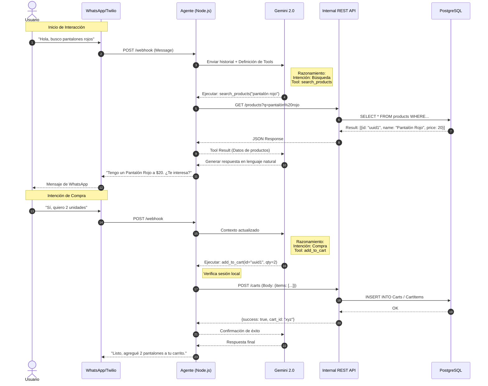
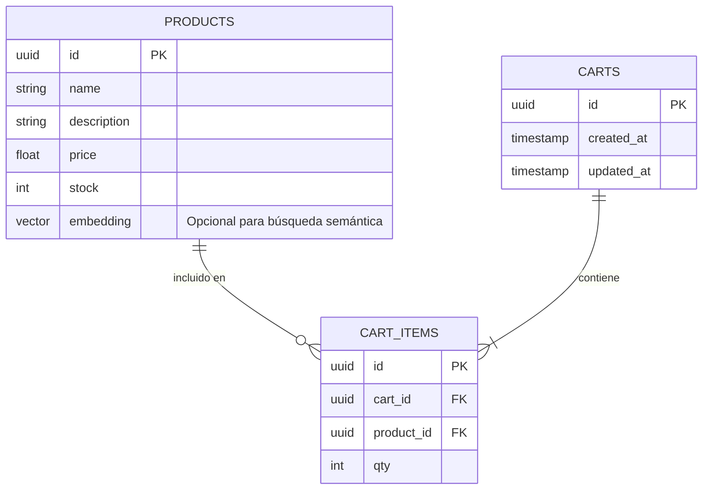

# Diagramas Técnicos - Laburen AI Agent

Este documento detalla la arquitectura, el flujo de datos y el modelo de base de datos del agente.

## 1. Arquitectura de Componentes (C4 Nivel Contenedor)

Este diagrama muestra cómo interactúan los servicios externos (WhatsApp/Twilio, Google Gemini) con nuestro servidor y cómo se divide la lógica interna entre el Agente y la API REST.

```mermaid
graph TD
    %% Estilos
    classDef external fill:#f9f9f9,stroke:#333,stroke-width:2px;
    classDef core fill:#e1f5fe,stroke:#0277bd,stroke-width:2px;
    classDef storage fill:#fff3e0,stroke:#ef6c00,stroke-width:2px;

    %% Nodos Externos
    User((Usuario WhatsApp)):::external
    Twilio[Twilio Sandbox Gateway]:::external
    Gemini[Google Gemini 2.0 Flash]:::external

    %% Nodos Internos
    subgraph "Laburen Server (Koyeb)"
        Webhook[Webhook Controller]:::core
        AgentService[Agent Logic Service]:::core
        
        subgraph "Internal REST API"
            API_Gateway[API Routes /api/...]:::core
            Prisma[Prisma ORM]:::core
        end
    end

    DB[(PostgreSQL Neon)]:::storage

    %% Conexiones
    User <-->|WhatsApp Protocol| Twilio
    Twilio <-->|HTTP POST Webhook| Webhook
    Webhook <--> AgentService
    AgentService <-->|Prompt & Tools| Gemini
    
    %% La conexión clave del challenge: El agente consume la API
    AgentService <-->|fetch (HTTP)| API_Gateway
    
    API_Gateway --> Prisma
    Prisma <-->|SQL Connection| DB
```

## 2. Diagrama de Secuencia: Flujo de Compra

Detalla el ciclo de vida de un mensaje desde que el usuario pide un producto hasta que se confirma la transacción. Muestra explícitamente el consumo de los endpoints REST (GET, POST, PATCH).



## 3. Modelo de Entidad-Relación (ERD)

Esquema de base de datos utilizado para persistir productos y carritos de compra.

